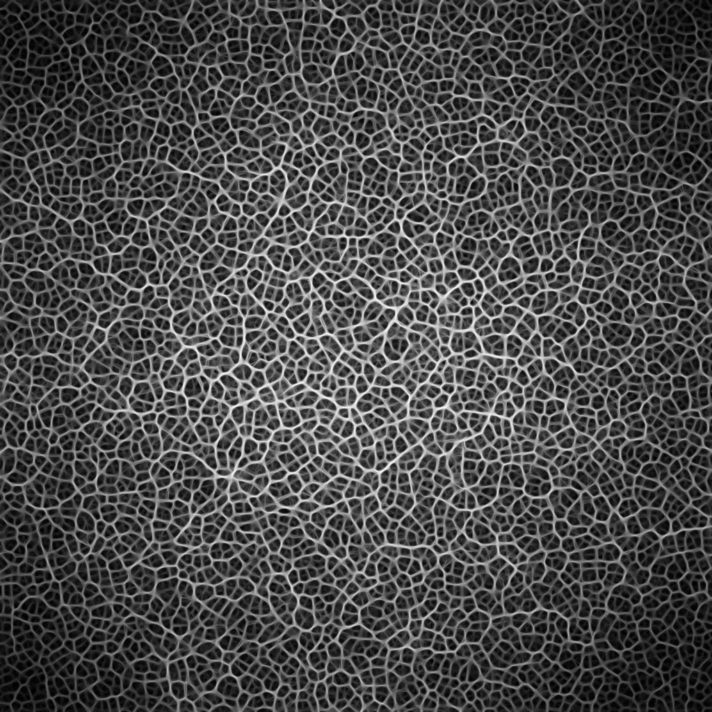

# Slime Simulation (WebGPU)



## About

An experiemental slime mold simulation built as an exercise in learning WebGPU and Rust.

Inspired by Sebastian Lague's [Slime Mold Simulation](https://www.youtube.com/watch?v=X-iSQQgOd1A) video.

## Running

```bash
# must be run in release for reasonable performance
cargo r -r

# --hdr flag enabled HDR rendering on macOS
cargo r -r -- --hdr
```

## Controls

- `W` and `S` to adjust sensor offset distance
- `A` and `D` to adjust move speed
- `Q` and `E` to adjust turn speed
- `R` to reset pan and zoom
- `C` to copy texture to clipboard
- `CMD` + mouse wheel to zoom
- `CMD` + trackpad scroll to zoom
- trackpad dragging to pan
